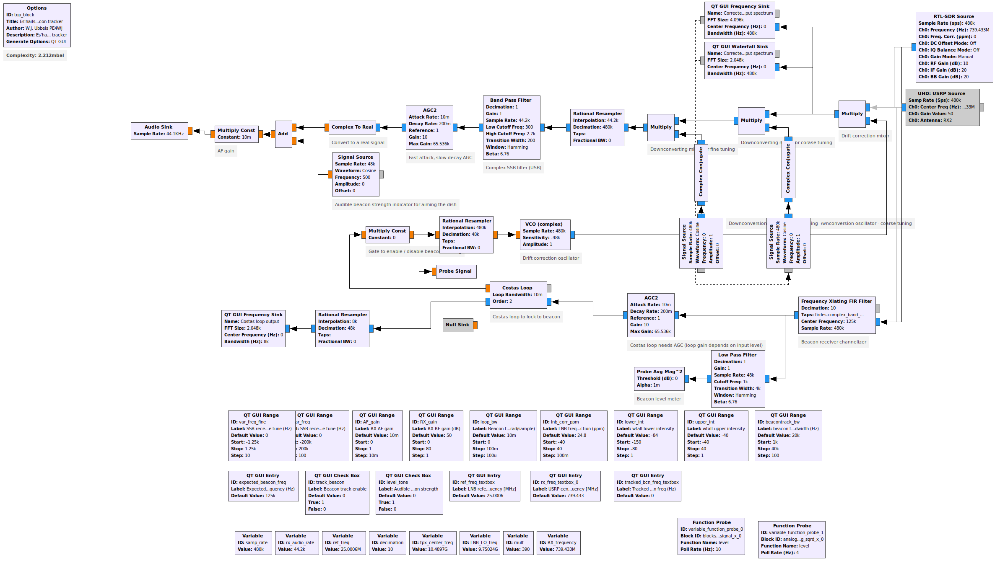

# eshailsat2
Scripts and flowgraphs for the Es'hailsat-2 amateur transponder

Included are:

-beacongen.py - a Python script for generating wav files containing a CW beacon, specified by an input string. Basic pulseshaping is used to remove key clicks.

-beacontrack.grc - a GNU Radio flowgraph for receiving the QO-100 / Es'hailsat-2 narrowband amateur transponder and performing phaselocking to the PSK400 beacon for automatic LNB drift correction

-eshailuplinkgen.grc - a GNU Radio flowgraph for generating an USB signal at 2.4 GHz for uplinking to the QO-100 / Es'hailsat-2 narrowband amateur transponder. Uses Controlled Envelope SSB blocks from https://github.com/drmpeg/gr-cessb
# Original Block diagram

Application screenshot

# Changes from original project
1) change input to rtl_sdr
2) disabled null object.

# Planed changes.
1) Adding APRS decoder link to PLL lock Frequency
2) Adding PSK mail server Link to PLL Lock Frequency
3) Adding Voice regonition AI engin
4) Adding AI signal identification system
